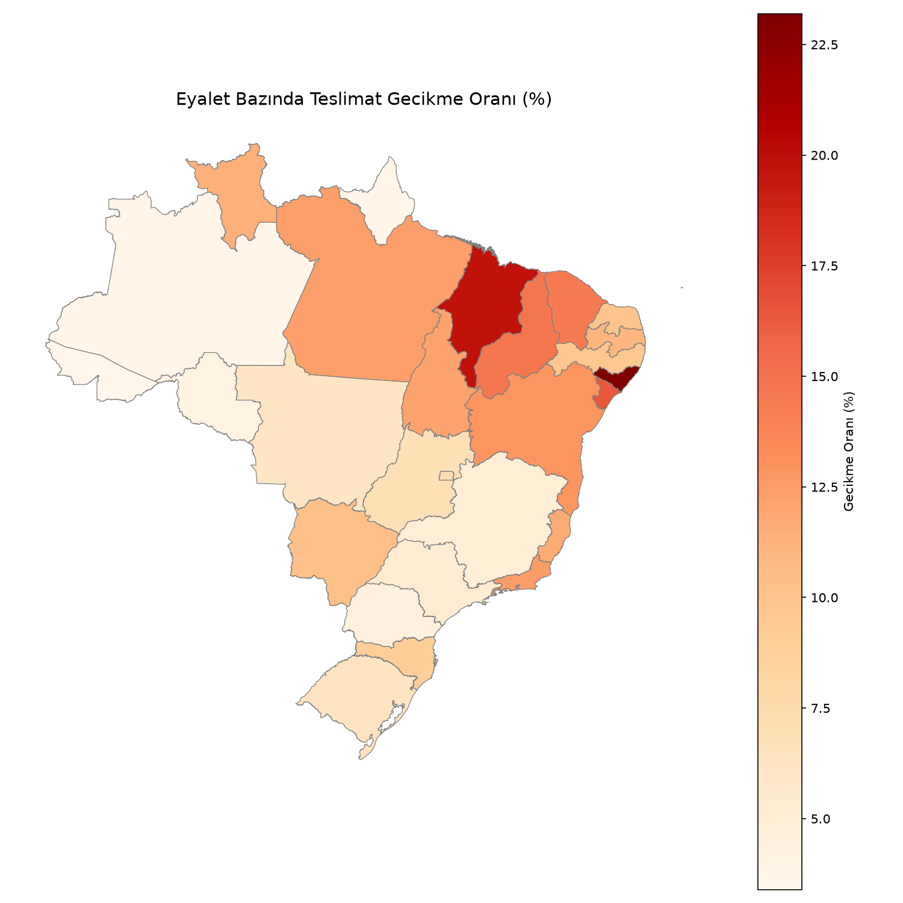
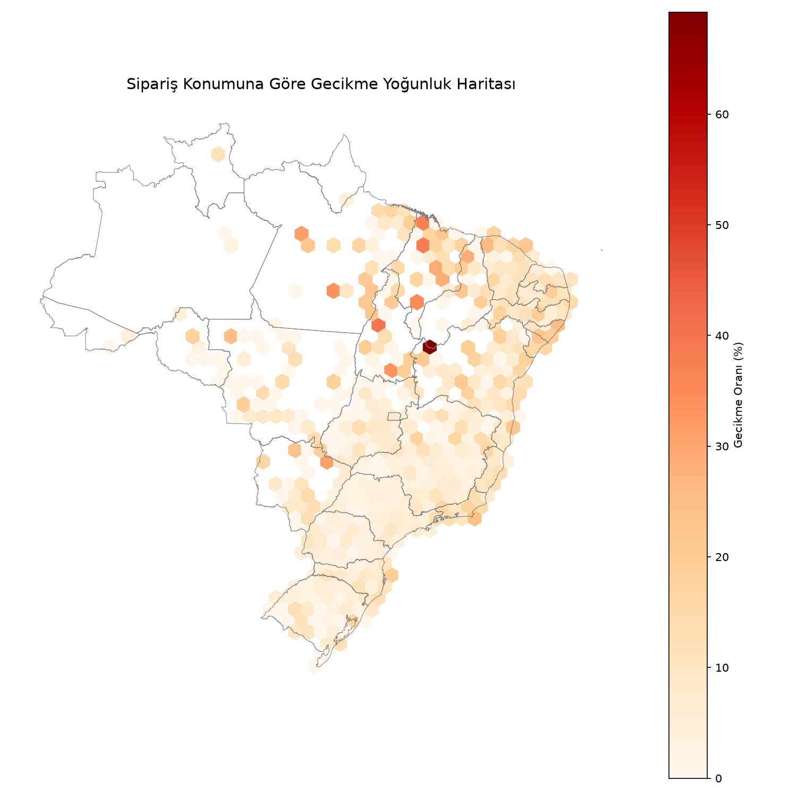
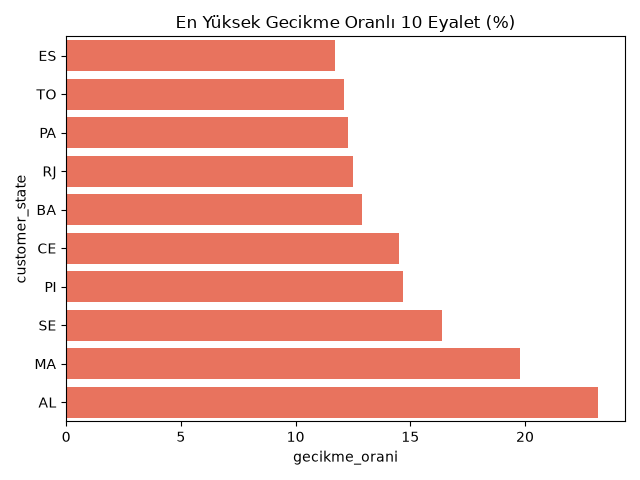
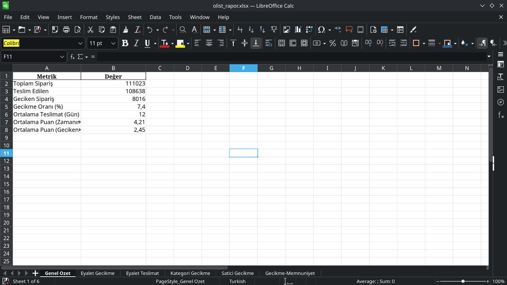

# 📊 Olist E-Ticaret Lojistik & Gecikme Analizi

Bu proje, Brezilya'nın önde gelen e-ticaret platformu **Olist**'e ait gerçek dünya 
verilerini kullanarak, tedarik zinciri ve lojistik süreçlerindeki darboğazları, 
eyalet bazlı teslimat gecikmelerini ve bu gecikmelerin müşteri memnuniyeti 
üzerindeki etkilerini analiz etmek amacıyla geliştirilmiştir.

## 🔑 Öne Çıkan Bulgu

> Zamanında teslim edilen siparişlerde ortalama müşteri puanı **4.21/5** iken, 
> geciken siparişlerde bu oran **2.45/5**'e düşmektedir. Bu, lojistik 
> performansın müşteri memnuniyeti üzerindeki doğrudan ve ölçülebilir etkisini 
> göstermektedir.

## 🚚 Projenin Lojistik Odak Noktası
* **Coğrafi Darboğaz Tespiti:** Siparişlerin hangi eyaletlerde ve rotalarda yoğun olarak geciktiğinin tespiti.
* **Müşteri Memnuniyeti Korelasyonu:** Teslimat gecikmelerinin, müşterilerin verdiği puanlar (`review_score`) üzerindeki doğrudan etkisi.
* **Kategori ve Satıcı Performansı:** Hangi ürün kategorilerinin lojistik süreçlerinde daha başarısız olduğunun analizi.

---

## 📈 Analiz Çıktıları ve Görselleştirmeler

### 1. Eyalet Bazında Teslimat Gecikme Oranları (Choropleth Map)
GeoPandas kullanılarak Brezilya eyaletlerinin ortalama gecikme oranları haritalandırılmıştır. Koyu renkli bölgeler lojistik operasyonların aksadığı lokasyonları göstermektedir.



### 2. Sipariş Konumuna Göre Gecikme Yoğunluğu
Siparişlerin koordinat verileri (Enlem/Boylam) filtrelenerek, teslimat süreçlerindeki mikrografik yoğunluklar haritaya işlenmiştir.



### 3. En Yüksek Gecikme Oranına Sahip İlk 10 Eyalet


### 4. Çok Sekmeli Excel Operasyon Raporu
Analiz çıktısı olarak üretilen `olist_rapor.xlsx` dosyası; yönetici özeti, eyalet performansları ve kategori analizleri gibi lojistik operasyon kararlarını destekleyecek sekmelerden oluşur.

> 

## 🛠️ Kullanılan Teknolojiler
- Python 3
- pandas
- geopandas
- seaborn / matplotlib

## 📂 Proje Yapısı 
├── src/
│   └── gecikme_analiz.py
├── data/              (veri seti buraya indirilir, repoya dahil değil)
├── assets/            (README görselleri)
│   ├── eyalet_gecikme_isi_haritasi.png
│   ├── gecikme_yogunluk_haritasi.png
│   ├── eyalet_gecikme_sns.png
│   └── excel_ss.png
├── reports/
│   ├── grafikler/
│   └── olist_rapor.xlsx
├── requirements.txt
└── README.md

## ⚙️ Kurulum ve Çalıştırma

1. Veri setini indir: [Olist Brazilian E-Commerce Dataset (Kaggle)](https://www.kaggle.com/datasets/olistbr/brazilian-ecommerce)
   CSV dosyalarını `data/` klasörüne yerleştir.

2. Eyalet sınırları için GeoJSON dosyasını indir ve `data/brazil_states.geojson` 
   olarak kaydet:https://raw.githubusercontent.com/codeforamerica/click_that_hood/master/public/data/brazil-states.geojson

3. Bağımlılıkları kur:
```bash
   pip install -r requirements.txt
```

4. Scripti çalıştır:
```bash
   python src/gecikme_analiz.py
```
